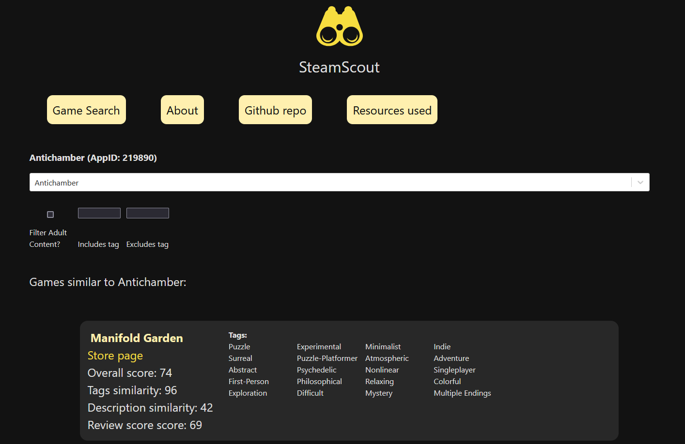

### A similarity search and recommendation system for finding games on Steam


***Find similar games to the ones you like - even if the genres you like are not very popular***



The system is a weighted ensemble recommender composed of:
- A recommender rating the games based on the similarity of their vectorized descriptions ("About this game" section)
- A recommender rating the similarity of games based on their tags
- A simple check for the ratio of positive user reviews to negative

Since this ensemble does not take into account the number of reviews (only the fraction of positive ones), it tends to catch games with very few reviews if they appear to be a good match to the one the user searched for.

Both the tags and descriptions are compared based on the cosine similarity of their vectors. 

The tags are binary vectors (consisting of 1s at the indices matching a particular tag the game has and 0s for tags it lacks). The description vector is generated by using doc2vec after training on the entire dataset.

The vectors are stored using [vectordb](https://github.com/jina-ai/vectordb/) for easy Approximate Nearest Neighbor search.

### Build & installation (Docker)

1. Clone this repository
2. Download the [Steam Games dataset](https://www.kaggle.com/datasets/fronkongames/steam-games-dataset) from Kaggle and put `games.json` inside `data/raw`
3. Modify the `users.json` file to inject temporary user login info (used during build time). E.g.
```
{
"user1": "pass1",
"user2": "pass2",
}
```
This is a temporary solution to add auth to this application while using file-based SQLite DBs. The file is deleted (in-container) during the build process and doesn't exist in the final image.

You also need to define a `JWT_SECRET` env variable (as seen in compose) that will be passed to the docker image and used to sign the JWTs.
4. Run `docker compose up` from the repo's directory.

Building the app will take a while (possibly 15+ minutes) since it's preprocessing the dataset and training doc2vec on it.

*(I did not want to include a pretrained model or the data as part of this repository)*

Running the app after it has been built uses the generated model and DBs so it should be much faster.

Due to heavy reliance on a local database, the app greatly benefits from using an SSD. Full Text Search and indexing on queried columns is used to reduce search delays.

By default, the frontend is available on the host machine at `http://localhost:8080`

### Unit tests

Unit tests can be executed from the `src` directory by running `python -m unittest discover ../tests`

---

*Utilizes the [Steam Games dataset](https://www.kaggle.com/datasets/fronkongames/steam-games-dataset) published on Kaggle by Martin Bustos Roman, originally generated with [Steam Games Scraper](https://github.com/FronkonGames/Steam-Games-Scraper) by Martin Bustos.*
