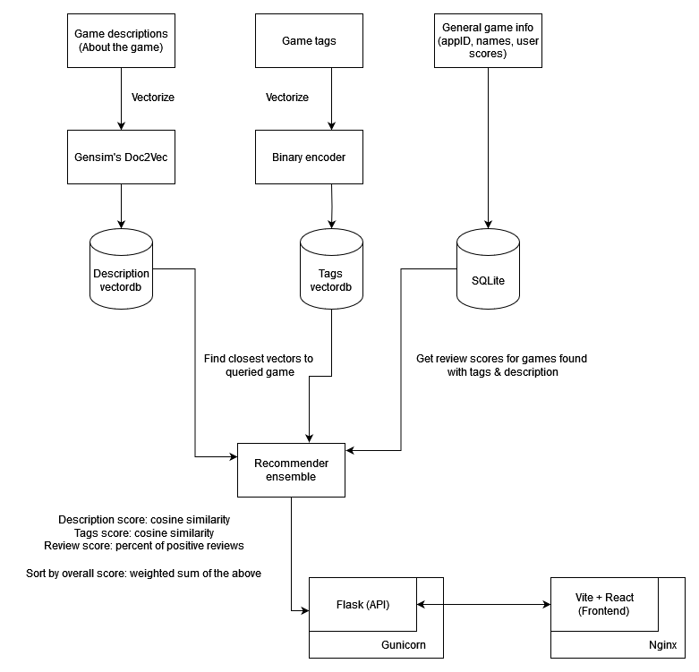

Data from the games dataset is processed as follows:

* Game descriptions are normalized by removing punctuation and transforming to lowercase. Gensim's `simple preprocess` function is used, after which a doc2vec model is trained on these texts (fit & transform). This creates the game description vectors
* Game tags are changed to binary vectors (e.g. `[0,0,0,1,1,0,1,...]`) where, according to a dictionary json file, each index corresponds to one of the tags that the game either has or doesn't have

These vectors are added to the existing dataframe, which is then used to create 3 databases: an sqlite DB containing all game information relevant for the recommender and two `vectordb` instances for tag and description vectors.

Vectordb's [HNSW](https://en.wikipedia.org/wiki/Hierarchical_navigable_small_world) implementation is useful for indexing vectors for a fast Approximate Nearest Neighbors search - great for finding similar items based on their embeddings.

The recommendations' workflow is then as follows:

1. A user requests games similar to game A (given its name or ID)
2. The vectors for game A are extracted from the sqlite database
3. The tags' vectordb is queried for N nearest neighbors of the game A's tag vector. Description database is queried analogically. This returns a list of 2N game ids.
4. Game ids generated above are queried in the main (sqlite) game database, returning between N and 2N deduplicated game results (including the titles, textual descriptions, tags etc.)
5. Results are sorted by overall recommendation score, which is the normalized weighted sum of the following:
   * Cosine similarity between the searched game's tag vector and the result's tag vector
   * Cosine similarity between the searched game's description vector and the result's description vector
   * Review score given as (no. positive reviews)/(no. all reviews)
6. Results are filtered based on additional criteria provided by the user, such as the tags the result should/should not include or the number of reviews.

The number of results queried from each vectordb (N above) is set to 30 by default, but increased if too few results were generated for a query (for example when filtering removed a lot of results)

Default weights are as follows:
* 0.5 for description similarity
* 1.0 for tags similarity
* 1.0 for review score

Increasing the description score's contribution increases the rating of results that are only superficially similar based on their themes (or the wording used). The default level makes the system reward additional similarity between items that cannot be expressed by the limited number of tags available in the data and makes it pick up some results that lack any tags, but are nevertheless related to the query. 

Previously, Gradio was used to simplify the creation of a web frontend for the recommendation system. Now the app has a separate backend implemented with Flask and frontend written in React.

A multistage docker build process is used to get rid of unprocessed and intermediate data files that are not needed to run a container once they have been added to the databases.

`Docker compose` is used to build and launch the two separate docker containers as a single web app. The Flask app is launched with Gunicorn and the static files generated by Vite are served by Nginx.